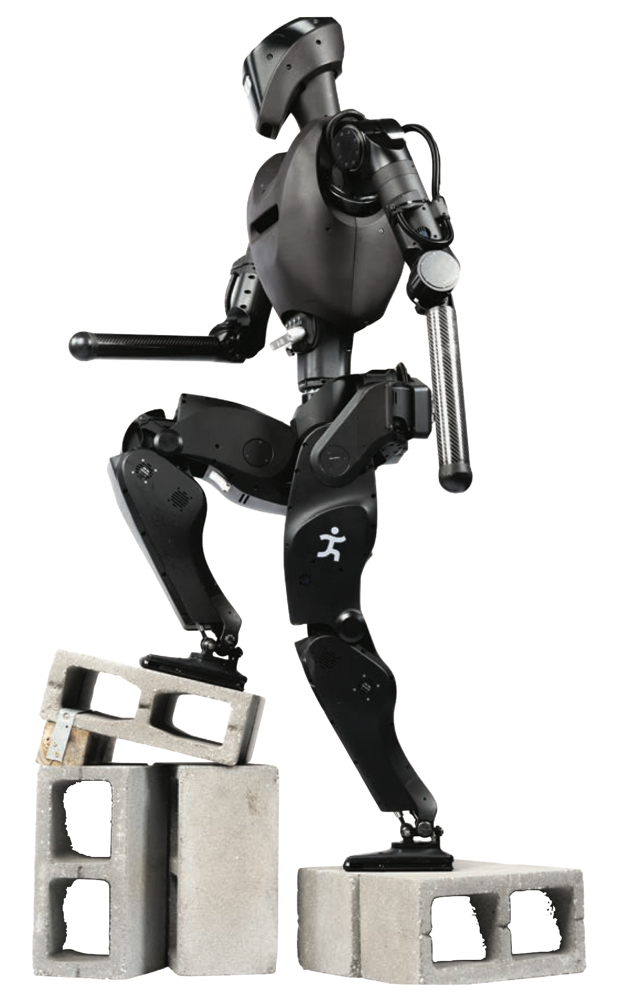
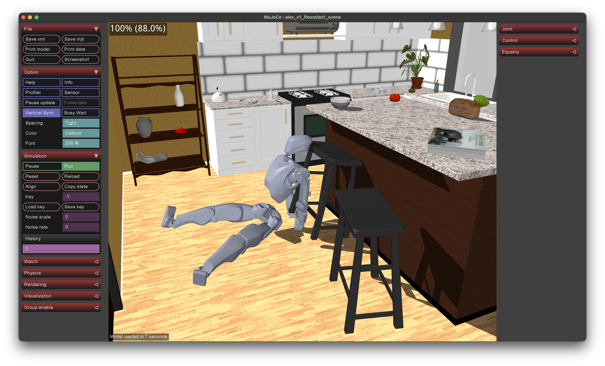

# Alex robot

Developing software and control for IHMC Alex humanoid robot.

## Scenes

Alex scenes are in dir `alex-scenes/`. Load `scene_alex_v1_full_body_mjx_room1.xml` to see Alex in a room.

Room scenes from https://github.com/allenai/molmospaces.

## Install

`pip install mujoco gymnasium stable_baselines`

## Run

###  MuJoCo

You can run alex model by dragging / dropping [this file](scenes/alex-scenes/scene_alex_v1_full_body_mjx_room1.xml) into MuJoCo. Or any file in that directory `scenes/alex-scenes/`

OR you can run with:

`python -m mujoco.viewer --mjcf Alex-robot/scenes/alex-scenes/scene_alex_v1_full_body_mjx_ec1.xml`

You will get this:

### RL learning

We can train VERY efficiently with [mjlab](https://github.com/e-lab/mjlab). Use this fork to train RL algorithms on your NVIDIA GPU PC. See readme there.

For pure MuJoCo RL training, see [this file](training/README.md).

## References

[IHMC Alex](https://www.ihmc.us/news20251119/) 