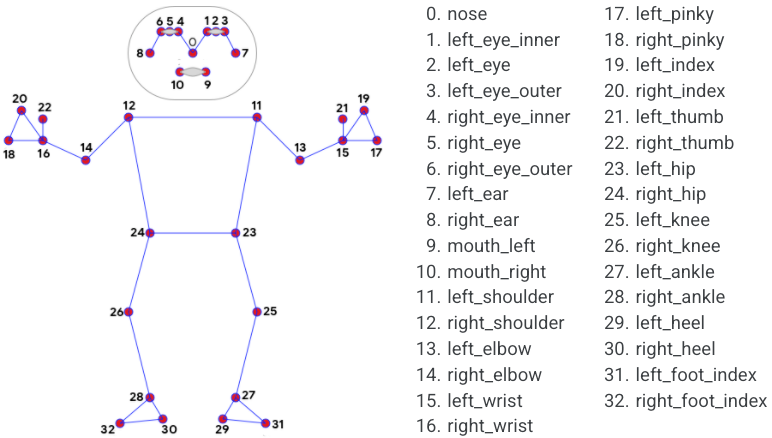

# Action collect and retarget

Extract human body keypoints from video using [MediaPipe Pose](https://ai.google.dev/edge/mediapipe/solutions/vision/pose_landmarker) and retarget the motion to the Alex robot for use with Mjlab.


*STATUS: NOT WORKING* - issue with referencing 2d points from the vidfeo to 3d poitns that are suitable for the robot body. 


## Pipeline

```
video file
    └─▶  action_collect_video.py  ──▶  keypoints.npz
                                            └─▶  motions/mediapipe_to_alex.py  ──▶  tracking.npz
```

## Requirements

- Python 3.8+
- [mediapipe](https://pypi.org/project/mediapipe/) >= 0.10
- opencv-python
- numpy
- scipy

```bash
pip install mediapipe opencv-python numpy scipy
```

Retargeting additionally requires **mjlab** and **torch**.

---

## Step 1 — Extract keypoints from video

```bash
python action_collect_video.py <video_path> [output_path] [options]
```

**Arguments:**

| Argument | Description |
|---|---|
| `video` | Path to the input video file (`.mp4`, `.mov`, etc.) |
| `output` | *(optional)* Output `.npz` path. Defaults to `<video_stem>_keypoints.npz` next to the input file |

**Options:**

| Flag | Default | Description |
|---|---|---|
| `--model` | `full` | Model variant: `lite`, `full`, or `heavy` |
| `--min-detection` | `0.5` | Minimum pose detection confidence |
| `--min-presence` | `0.5` | Minimum pose presence confidence |
| `--min-tracking` | `0.5` | Minimum tracking confidence |
| `--num-poses` | `1` | Maximum number of people to track per frame |

**Examples:**

```bash
# Basic usage — output saved as open_door1_keypoints.npz
python action_collect_video.py open_door1.mov

# Explicit output path
python action_collect_video.py open_door1.mov open_door.npz

# Higher accuracy model, stricter confidence thresholds
python action_collect_video.py open_door1.mov open_door.npz --model heavy --min-detection 0.7

# Track up to 2 people
python action_collect_video.py scene.mp4 scene.npz --num-poses 2
```

> **Model download:** On first run, the pose landmarker model (`.task` file) is downloaded automatically into the project directory. Model sizes: `lite` ~9 MB, `full` ~30 MB, `heavy` ~130 MB.

### Keypoint NPZ format

| Key | Shape | Description |
|---|---|---|
| `keypoints` | `(N, 33, 4)` | Normalized image-space landmarks — `x, y, z, visibility` in `[0, 1]` |
| `world_keypoints` | `(N, 33, 4)` | Metric world-space landmarks — `x, y, z` in meters, `visibility` in `[0, 1]` |
| `frame_indices` | `(N,)` | Frame numbers from the source video where a pose was detected |
| `landmark_names` | `(33,)` | Name string for each of the 33 landmark indices |

`N` is the number of frames where at least one pose was detected. Frames with no detection are skipped.

### Landmarks

MediaPipe Pose tracks 33 body landmarks:

```
 0  NOSE                17  LEFT_PINKY
 1  LEFT_EYE_INNER      18  RIGHT_PINKY
 2  LEFT_EYE            19  LEFT_INDEX
 3  LEFT_EYE_OUTER      20  RIGHT_INDEX
 4  RIGHT_EYE_INNER     21  LEFT_THUMB
 5  RIGHT_EYE           22  RIGHT_THUMB
 6  RIGHT_EYE_OUTER     23  LEFT_HIP
 7  LEFT_EAR            24  RIGHT_HIP
 8  RIGHT_EAR           25  LEFT_KNEE
 9  MOUTH_LEFT          26  RIGHT_KNEE
10  MOUTH_RIGHT         27  LEFT_ANKLE
11  LEFT_SHOULDER       28  RIGHT_ANKLE
12  RIGHT_SHOULDER      29  LEFT_HEEL
13  LEFT_ELBOW          30  RIGHT_HEEL
14  RIGHT_ELBOW         31  LEFT_FOOT_INDEX
15  LEFT_WRIST          32  RIGHT_FOOT_INDEX
16  RIGHT_WRIST
```



### Loading the keypoint data

```python
import numpy as np

data = np.load("open_door.npz", allow_pickle=True)

keypoints       = data["keypoints"]       # (N, 33, 4)  image-space
world_keypoints = data["world_keypoints"] # (N, 33, 4)  world-space (meters)
frame_indices   = data["frame_indices"]   # (N,)
landmark_names  = data["landmark_names"]  # (33,)

# Access a specific landmark — e.g. right wrist across all frames
RIGHT_WRIST = 16
wrist_xy = keypoints[:, RIGHT_WRIST, :2]  # (N, 2)

# Filter by visibility
visibility = keypoints[:, :, 3]           # (N, 33)
confident  = visibility > 0.5
```

---

## Step 2 — Retarget to Alex robot

```bash
python motions/mediapipe_to_alex.py <keypoints.npz> [output.npz] [options]
```

Takes the keypoint NPZ produced in Step 1 and outputs a tracking NPZ compatible with the Mjlab motion tracking loader.

**Arguments:**

| Argument | Description |
|---|---|
| `input_npz` | Path to the keypoints NPZ from Step 1 |
| `output_npz` | *(optional)* Output path. Defaults to `motions/<input_stem>_alex_tracking.npz` |

**Options:**

| Flag | Default | Description |
|---|---|---|
| `--input-fps` | `30.0` | FPS of the source video |
| `--output-fps` | `50.0` | FPS for the tracking output |
| `--device` | `cuda:0` | PyTorch device (`cpu`, `cuda:0`, etc.) |
| `--frame-range START END` | — | 0-indexed half-open slice `[START, END)` to process |

**Examples:**

```bash
# Basic — output saved as motions/open_door_keypoints_alex_tracking.npz
python motions/mediapipe_to_alex.py open_door_keypoints.npz

# Explicit output path, run on CPU
python motions/mediapipe_to_alex.py open_door.npz motions/open_door_alex.npz --device cpu

# Process only frames 10–80, source was 60 fps video
python motions/mediapipe_to_alex.py open_door.npz --frame-range 10 80 --input-fps 60
```

### Retargeting approach

The script converts 3-D body keypoints to robot joint angles using geometric retargeting:

| Joint | Method |
|---|---|
| Hip pitch / roll | Femur direction projected into pelvis local frame → `atan2` |
| Hip yaw | Set to 0 (not recoverable from monocular video) |
| Knee flexion | Angle between femur and tibia vectors |
| Shoulder pitch / roll | Upper-arm direction projected into thorax local frame → `atan2` |
| Elbow flexion | Angle between upper arm and forearm vectors |
| Spine yaw | Signed angle between pelvis and thorax forward directions |

**Coordinate transform:** MediaPipe world coordinates (Y-up) are converted to the MuJoCo simulator frame (Z-up) as `sim_x = -mp_z`, `sim_y = -mp_x`, `sim_z = mp_y`.

**Root position:** MediaPipe world landmarks are centred at the hip midpoint each frame, so global XY translation is not available. The root is placed at a fixed standing position (`ALEX_HIP_HEIGHT = 0.88 m`). Adjust this constant in the script if needed.

### Tracking NPZ format

Output keys are compatible with the Mjlab tracking motion loader:

| Key | Description |
|---|---|
| `fps` | Scalar — output frames per second |
| `joint_pos` | `(N, J)` — joint positions for all robot joints |
| `joint_vel` | `(N, J)` — joint velocities |
| `body_pos_w` | `(N, B, 3)` — body link positions in world frame |
| `body_quat_w` | `(N, B, 4)` — body link orientations (WXYZ) in world frame |
| `body_lin_vel_w` | `(N, B, 3)` — body link linear velocities |
| `body_ang_vel_w` | `(N, B, 3)` — body link angular velocities |

### Alex joint order

The 15 actuated joints written by the retargeting script:

```
spine_z
left_hip_x   left_hip_z   left_hip_y   left_knee_y
right_hip_x  right_hip_z  right_hip_y  right_knee_y
left_shoulder_y   left_shoulder_x   left_elbow_y
right_shoulder_y  right_shoulder_x  right_elbow_y
```

---

## Files

| File | Description |
|---|---|
| `action_collect_video.py` | Step 1 — video → keypoint `.npz` |
| `motions/mediapipe_to_alex.py` | Step 2 — keypoint `.npz` → Alex tracking `.npz` |
| `motions/lafan_to_alex.py` | LAFAN CSV (G1 joint order) → Alex tracking `.npz` |
| `motions/lafan_to_g1.py` | LAFAN CSV (G1 joint order) → G1 tracking `.npz` |
| `action_collect.py` | Original reference script (webcam / static images) |
