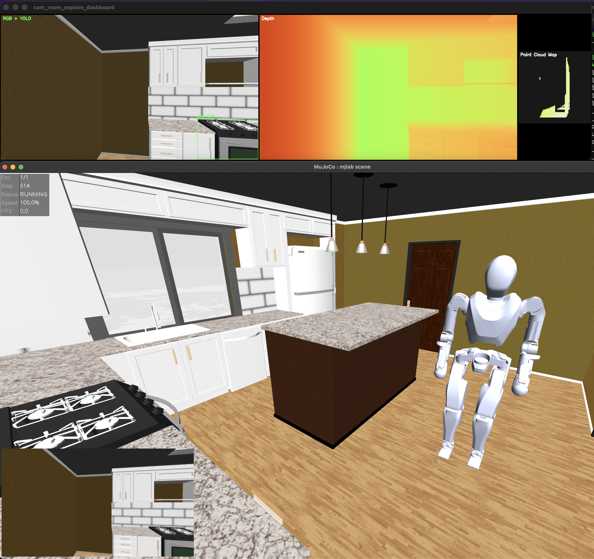

# Alex room explore



Requires [mjlab from e-Lab](https://github.com/e-lab/mjlab) with IHMC robot models and environments.

If installing [mjlab from pip](https://mujocolab.github.io/mjlab/main/source/installation.html) with:

```bash
pip install mjlab
```

copy the robot and envs over from the [e-lab/mjlab](https://github.com/e-lab/mjlab) repo:

```bash
MJLAB_INSTALL=$(python -c "import mjlab, os; print(os.path.dirname(mjlab.__file__))")

cp -r mjlab/src/mjlab/asset_zoo/robots/alex_V1_description $MJLAB_INSTALL/asset_zoo/robots/
cp -r mjlab/src/mjlab/tasks/velocity/config/alex          $MJLAB_INSTALL/tasks/velocity/config/
cp -r mjlab/src/mjlab/tasks/tracking/config/alex          $MJLAB_INSTALL/tasks/tracking/config/
```

Also add the Alex exports to `$MJLAB_INSTALL/asset_zoo/robots/__init__.py`:

```python
from mjlab.asset_zoo.robots.alex_V1_description.alex_constants import (
  ALEX_ACTION_SCALE as ALEX_ACTION_SCALE,
)
from mjlab.asset_zoo.robots.alex_V1_description.alex_constants import (
  get_alex_robot_cfg as get_alex_robot_cfg,
)
```

### Known issues with pip-installed mjlab

**1. `stochastic`/`init_noise_std` kwargs not supported**

The Alex rl_cfg files use `stochastic=True` and `init_noise_std=1.0` in `RslRlModelCfg`, which the pip version doesn't support. Remove those kwargs from:
- `$MJLAB_INSTALL/tasks/velocity/config/alex/rl_cfg.py`
- `$MJLAB_INSTALL/tasks/tracking/config/alex/rl_cfg.py`

**2. Checkpoint has extra `distribution.std_param` key**

The pre-trained checkpoint was saved with a newer mjlab. Fix in `controllers/locomotion_controller.py` line 94:
```python
runner.load(..., strict=False, ...)  # was strict=True
```

**3. Missing viewer attributes (`_render_timer`, `_sim_timer`, etc.)**

The pip version of `NativeMujocoViewer` is missing timer attributes added in newer mjlab. A compatibility shim is already applied in `alex_room_explore.py` via `_NoOpTimer`.

**4. Scene object symlinks are broken**

`scenes/objects/thor`, `objaverse`, and `objathor_metadata` are symlinks to a Mac path. Fix by downloading assets via molmospaces and relinking:

```bash
pip install git+https://github.com/allenai/molmospaces.git
python -c "
from molmo_spaces.utils.lazy_loading_utils import install_scene_with_objects_and_grasps_from_path
from molmo_spaces.molmo_spaces_constants import get_scenes
install_scene_with_objects_and_grasps_from_path(get_scenes('ithor', 'train')['train'][1])
"

# Re-link to downloaded cache
OBJECTS=scenes/objects
rm $OBJECTS/thor $OBJECTS/objaverse $OBJECTS/objathor_metadata
ln -s ~/.cache/molmo-spaces-resources/objects/thor/20251117         $OBJECTS/thor
ln -s ~/.cache/molmo-spaces-resources/objects/objaverse/20260131    $OBJECTS/objaverse
ln -s ~/.cache/molmo-spaces-resources/objects/objathor_metadata/20260129 $OBJECTS/objathor_metadata
```

After installing molmospaces, restore mujoco to 3.6.0 (it gets downgraded):
```bash
pip install "mujoco==3.6.0"
```

**5. `mjpython` not available with pip install**

Use plain `python` instead:

```bash
python run.py
```

Runs a walking policy for Alex in the room scene, with the same manual and prompt-driven exploration flow as `demos/cam_room_explore`, but using Alex locomotion instead of the camera robot.

Run:

```bash
cd demos/alex_room_explore/
python run.py
```

Run to explore automatically for objects:

```bash
python run.py --prompt oven
```

You can control the robot walking with manual commands:

- `Up` / `Down`: forward / backward
- `Left` / `Right`: turn left / right
- `Cmd` + `Left` / `Right`: strafe left / right


Tests:

```bash
cd training/alex-room-explore/
mjpython tests/test_alex_room.py
```
