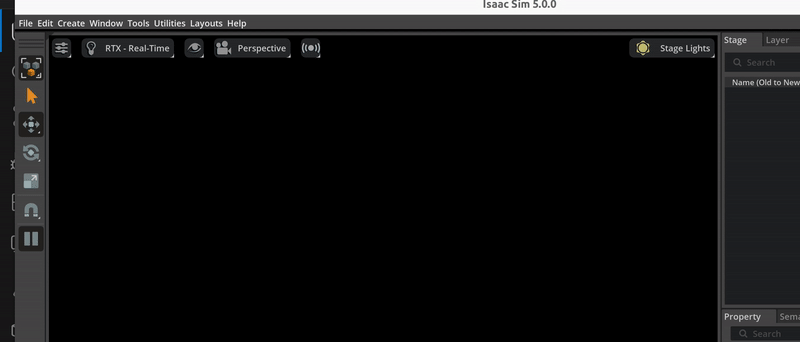

# Alex Isaac Sim RL Bring-up (Python-only ONNX Policy Test)

## Folder Structure

```
isaac-sim-rl-bringup/
├── README.md          ← this file — setup & run instructions
├── scripts/           ← Python scripts for running the policy in Isaac Sim
├── scenes/            ← scene configs, USD references, room layouts
├── models/            ← policy ONNX files (not in git — copy manually)
└── docs/              ← integration notes, diagrams, results
└── images/            ← output videos
```

Runs the walking ONNX policy entirely in Python inside Isaac Sim — no Java, no DDS.
The robot is placed on a defaultGroundPlane.

---

## Path conventions used in this README

| Purpose | Path |
|---------|------|
| This repo | `~/pathtoFolder/Alex-robot/isaac-sim-rl-bringup/` |
| IsaacLab clone | `~/pathtoFolder/IsaacLab/` |
| Isaac Sim build | `~/pathtoFolder/IsaacSim/_build/linux-x86_64/release/` |
| Robot URDF + meshes | `Alex-robot/alex_models/alex_V1_description/rl_urdf/alex_v1.rlModel_nubForearms_robotAccurate_torsoFootCollisions_abs_paths.urdf` |

---

## Requirements

### 1. Hardware
- NVIDIA GPU (recommended) or CPU-only

### 2. Isaac Sim
Version used: **5.1.0-rc.19** 
Built output : `~/pathtoFolder/IsaacSim/_build/linux-x86_64/release/`

**Option A — pip install (Isaac Sim 4.x+):**
```bash
pip install isaacsim --extra-index-url https://pypi.nvidia.com
```

**Option B — Build from source (slow, ~1-2 hours):**
```bash
git clone <isaac-sim-source-repo> ~/pathtoFolder/IsaacSim
cd ~/pathtoFolder/IsaacSim
./build.sh
```

### 3. IsaacLab
Clone the IHMC fork (includes Alex robot config in `isaaclab_assets`):
```bash
git clone https://github.com/ihmcrobotics/IsaacLab.git ~/pathtoFolder/IsaacLab
cd ~/pathtoFolder/IsaacLab
./isaaclab.sh --install
```

Create the symlink to Isaac Sim:
```bash
ln -s ~/pathtoFolder/IsaacSim/_build/linux-x86_64/release \
    ~/pathtoFolder/IsaacLab/_isaac_sim
```

### 4. Install onnxruntime inside IsaacLab's Python
```bash
cd ~/pathtoFolder/IsaacLab
./isaaclab.sh -p -m pip install onnxruntime
```

### 5. Robot URDF + meshes
Already available in this repo at `alex_models/alex_V1_description/` — no extra copy needed.
The script auto-detects this path when run from `scripts/`.

### 6. ONNX policy model
Copy the walking policy into the `models/` folder:
Not in git — copy manually from the lab machine. The script auto-detects `models/` first, then falls back to the alex repo path.

### 8. Verify isaaclab_assets has Alex robot config
```bash
cd ~/pathtoFolder/IsaacLab
./isaaclab.sh -p -c "from isaaclab_assets.ihmc.robots.alex import alex; print('OK')"
```

---

## Running

```bash
cd ~/pathtoFolder/IsaacLab
./isaaclab.sh -p ~/pathtoFolder/Alex-robot/isaac-sim-rl-bringup/scripts/alex_onnx_walking_policy.py
```

Optional CLI args:
```bash
# Start walking forward at 0.5 m/s
./isaaclab.sh -p .../alex_onnx_walking_policy.py --vx 0.5

# Start in standing mode
./isaaclab.sh -p .../alex_onnx_walking_policy.py --standing

# Start stationary (velocity = 0)
./isaaclab.sh -p .../alex_onnx_walking_policy.py --vx 0.0

# Load the molmospaces ithor room scene (FloorPlan1)
./isaaclab.sh -p .../alex_onnx_walking_policy.py --scene room
```

**`--scene room` note:** Uses the pre-built USD from `molmospaces` (downloaded via `ms-download`). The scene includes full structural collision (ConvexHull colliders, `CollisionAPI`). Robot spawns at `z=0.93 m` on the kitchen floor.

**Prerequisite — download the room USD once:**
```bash
cd /path/to/molmospaces/molmo_spaces_isaac
pip install -e .[dev,sim]
pip install -e /path/to/molmospaces/   # installs molmospaces_resources
ms-download --type usd --install-dir /path/to/Alex-robot/assets/usd --scenes ithor
```
This downloads to `~/.molmospaces/usd/scenes/ithor/` and symlinks to `assets/usd/scenes/ithor/`.

### Keyboard controls (focus the Isaac Sim viewport first)

| Key | Action |
|-----|--------|
| Arrow Up / Numpad 8 | Walk forward |
| Arrow Down / Numpad 2 | Walk backward |
| Arrow Left / Z | Turn left (yaw +) |
| Arrow Right / X | Turn right (yaw -) |
| Q / Numpad 4 | Strafe left |
| E / Numpad 6 | Strafe right |
| L | Stop — reset velocity to zero |
| S | Toggle standing mode (standing_flag) |

- Opens an Isaac Sim viewer window (not headless)
- Per-tick terminal prints: mode, commanded velocity, root position, hip/knee angles, contact forces, action magnitude
- Close the viewer window to exit

---



## What the script does

| Component | Detail |
|-----------|--------|
| Policy | `2026-03-17_23-20-27_flatfeet` — 80-dim obs, 23-dim action |
| Control | PD position targets at 50 Hz (4 physics substeps × 5 ms) |
| Keyboard | `isaaclab.devices.Se2Keyboard` via carb — live velocity updates each tick |
| Command | `[vx, vy, yaw, standing_flag]` — set by CLI args, updated by keyboard |
| Scene | `--scene groundplane` (default) or `--scene room` (ithor FloorPlan1, pre-built molmospaces USD with full collision physics) |

---

## Troubleshooting

**`isaaclab_assets` import error**
Make sure you cloned the IHMC fork of IsaacLab, not the upstream one.

**ONNX model not found**
The model is excluded from git. Copy `policy.onnx` manually from the lab machine into `models/`.

**`_isaac_sim` symlink missing**
```bash
ln -s ~/pathtoFolder/IsaacSim/_build/linux-x86_64/release \
    ~/pathtoFolder/IsaacLab/_isaac_sim
```
